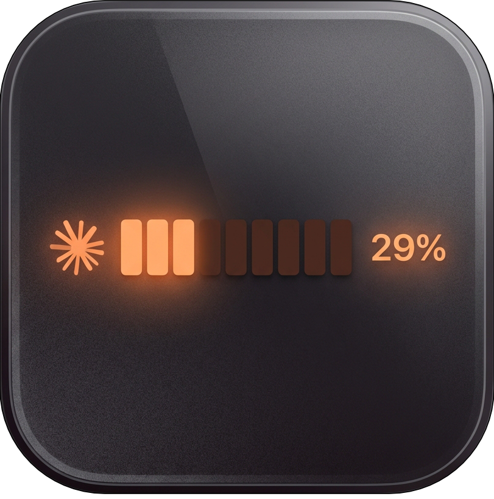
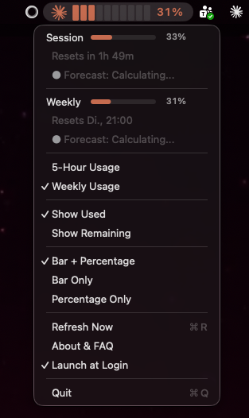

# Claude Usage Bar

<p align="center">
  
</p>

<p align="center">
  <strong>A tiny macOS menu bar app that shows your Claude usage at a glance.</strong><br>
  100% local. No cloud. No account needed. Just works.
</p>

<p align="center">
  <a href="https://github.com/geckse/claude-usage-mac-toolbar/releases/latest">Download Latest Release</a>
</p>

---



## Features

- **Menu bar usage indicator** — see your Claude usage as a segmented bar + percentage, right in the menu bar
- **Session & Weekly tracking** — both the 5-hour rolling window and the 7-day weekly cap, always visible
- **Usage forecasting** — predicts if you'll exhaust your credits before the next reset, based on your actual usage pace
- **Pace indicator** — colored dot (green / yellow / red) shows at a glance whether you're on track or burning through credits
- **Launch at Login** — one-click toggle to start automatically
- **About & FAQ** — built-in help window explaining how everything works

## Privacy First

- **100% local** — all data stays on your machine. Nothing is sent anywhere except the single API call to check your usage
- **No account or API key needed** — reads the OAuth token that Claude Code already stores in your macOS Keychain
- **Local history** — usage snapshots are saved to `~/Library/Application Support/ClaudeUsageBar/` and auto-pruned after 7 days
- **No telemetry, no analytics, no tracking**

## How Forecasting Works

The app records your usage every 60 seconds. It calculates your rate of consumption over the recent period and projects forward to when your limit resets:

- **Green** — On pace: projected usage under 80% at reset
- **Yellow** — Moderate: projected 80–95% at reset
- **Red** — Heavy: projected over 95% at reset

The forecast appears as "Calculating..." for the first few minutes while it collects enough data points.

## Install

### Download

Grab the latest `.app` from the [Releases page](https://github.com/geckse/claude-usage-mac-toolbar/releases/latest).

Move it to `/Applications` and open it. That's it.

### Build from source

```bash
git clone https://github.com/geckse/claude-usage-mac-toolbar.git
cd claude-usage-mac-toolbar
./build.sh
open "dist/Claude Usage Bar.app"
```

Requires Xcode Command Line Tools (`xcode-select --install`).

## Prerequisites

You need to be signed into [Claude Code](https://claude.ai/claude-code) on your Mac. The app reads the existing OAuth token from your macOS Keychain — no manual configuration required.

## Display Options

Toggle these from the context menu:

| Option | Description |
|--------|-------------|
| **5-Hour / Weekly** | Which window to show in the menu bar |
| **Show Used / Remaining** | Flip between "42% used" and "58% remaining" |
| **Bar + Percentage / Bar Only / Percentage Only** | Choose your preferred menu bar style |

## License

MIT License. Free and open source.

## Disclaimer

This app is **not affiliated with, endorsed by, or associated with Anthropic** in any way. It is an independent utility made from developer to developer.

---

Created by [Marcel Claus-Ahrens](https://github.com/geckse)
